# Linux Infrastrukturos Laboratorija – Povilas

Sveiki atvyke i **Povilo Linux Infrastrukturos Laboratorija** – pilnai sukonstruota infrastrukturos projekta, demonstruojanti profesinius igudžius, reikalingus sistemu administratoriaus, DevOps ar IT infrastrukturos specialisto rolems.

Šis projektas buvo sukurtas taip, kad **100% atitiktu realu darbo aprašyma**, iskaitant:

- Linux (Debian/Ubuntu) administravima  
- Web, DNS, MariaDB, Exim4 el. pašto servisus  
- VPN (WireGuard) ir saugumo valdyma  
- Monitoringa (Prometheus + Grafana + Node Exporter)  
- Atsarginiu kopiju sistema (Restic)  
- Healthcheck API kurima  
- Tinklo, serviso ir našumo diagnostika  
- Sistemini planavima, diegima ir dokumentavima  

Projektas sukonstruotas kaip **mini imones IT infrastruktura**, su realiais servisais, procesais, automatizacija ir profesionalia dokumentacija.

---

# ??? Architekturos schema

```
                 +---------------------------+
                 |       Klientu irenginiai  |
                 +-------------+-------------+
                               |
                               v
                   +-----------------------+
                   |        UFW Firewall   |
                   | 22,80,443,3000,9091   |
                   | 9100,51820 leidimai   |
                   +-----------+-----------+
                               |
                               v
+------------------------ Linux Serveris ------------------------+
|                                                              |
|  +-------------------+    +---------------------------+      |
|  |  Web (Apache)     |    |      Exim4 Paštas         |      |
|  |  Healthcheck API  |    |  Vietinis pristatymas     |      |
|  +---------+---------+    +-------------+-------------+      |
|            |                             |                  |
|            v                             v                  |
|    +---------------+             +----------------------+    |
|    | MariaDB       |             | Bind9 DNS Server     |    |
|    | DB testai     |             | demo.local zona      |    |
|    +-------+-------+             +----------+-----------+    |
|            |                                 |              |
|            v                                 v              |
|    +-------------------+       +---------------------------+ |
|    | Restic Backups    |       | WireGuard VPN (wg0)       | |
|    | Automatizacija    |       | saugus tunelis            | |
|    +-------------------+       +-------------+-------------+ |
|                                              |               |
|                                              v               |
|                                      +----------------+       |
|                                      | Monitoring     |       |
|                         +------------+ Prometheus     +-------+
|                         |            | Node Exporter  |
|                         |            | Grafana        |
|                         |            +----------------+
+--------------------------------------------------------------+
```

---

# ?? Projekto struktura

```
linux-infrastructure-lab/
¦
+-- monitoring/
¦   +-- prometheus.yml
¦   +-- node_exporter.service
¦   +-- screenshots/
¦
+-- backups/
¦   +-- backup.sh
¦   +-- README.md
¦   +-- screenshots/
¦
+-- dns/
¦   +-- db.demo.local
¦   +-- named.conf.local
¦   +-- README.md
¦   +-- screenshots/
¦
+-- email/
¦   +-- README.md
¦   +-- screenshots/
¦
+-- vpn/
¦   +-- README.md
¦   +-- screenshots/
¦
+-- security/
¦   +-- firewall/
¦       +-- ufw-rules.md
¦       +-- screenshots/
¦
+-- api-healthcheck/
¦   +-- public/health.php
¦   +-- check.sh
¦   +-- README.md
¦   +-- screenshots/
¦
+-- README.md (šis failas)
```

---

# ??? 1. Monitoringas  
**Prometheus + Grafana + Node Exporter**

### ?? Kas padaryta
- Idiegtas Node Exporter
- Sukonfiguruotas Prometheus su `prometheus.yml`
- Grafana su Node Exporter dashboard ID: 1860
- Sukurtos systemd paslaugos

### ?? Ekrano nuotraukos

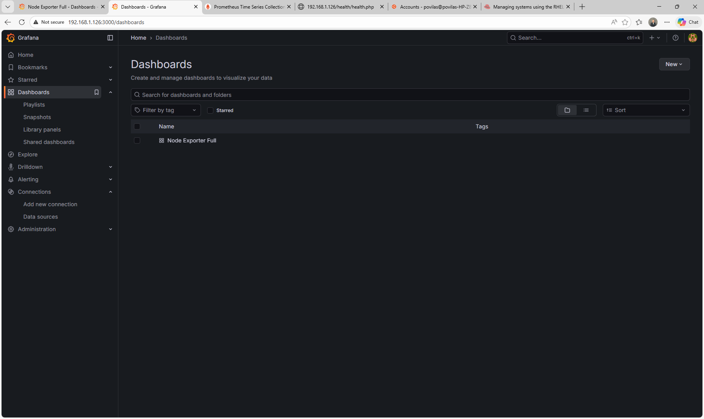  
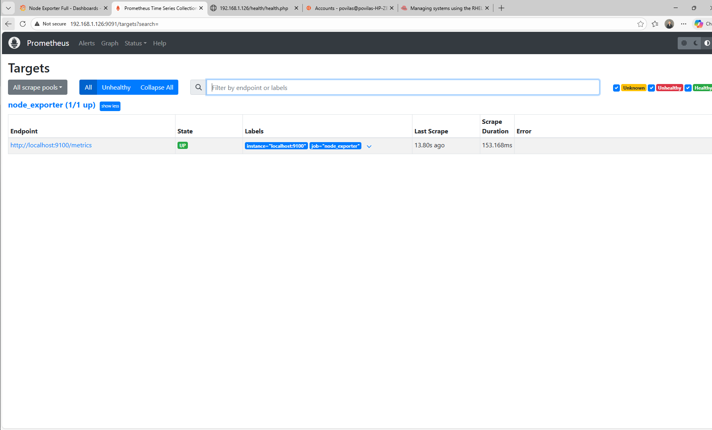  
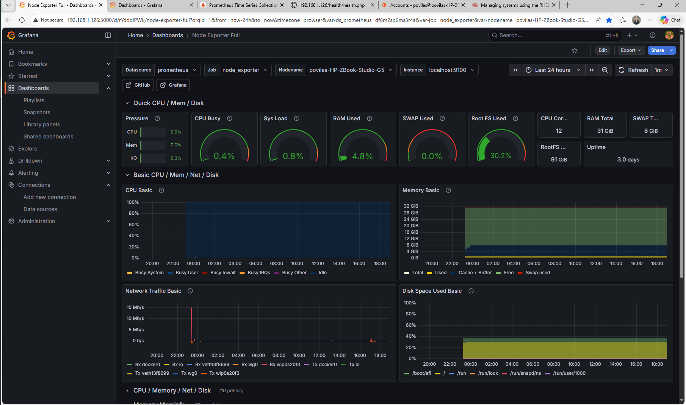

---

# ?? 2. Atsargines kopijos (Restic)

### ?? Kas padaryta
- Sukurtas `backup.sh` skriptas
- Restic saugykla /repo (failu sistema)
- Atsargines kopijos kasdien per cron
- Log'ai `/var/log/restic-backup.log`

### Komanda inicijuoti repozitorija:
```
restic init -r /repo
```

### Komanda atlikti kopija:
```
restic backup /etc /var/www /home
```

### ?? Screenshot
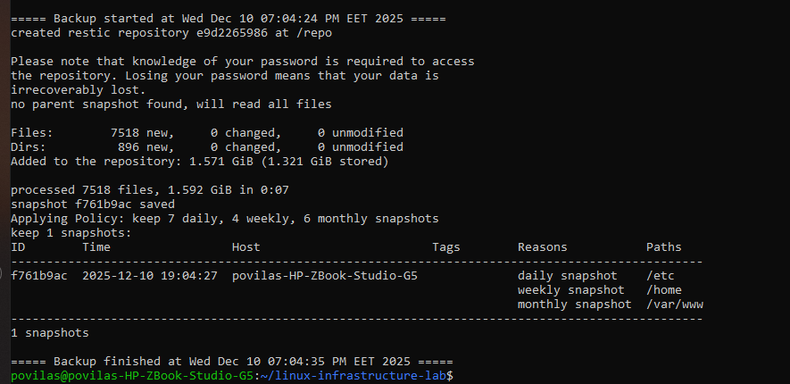

---

# ?? 3. DNS – Bind9

### ?? Kas padaryta:
- Sukurta zona: **demo.local**
- Irašai: A, NS, MX, CNAME
- Zona validuota `named-checkzone`

### ?? Screenshot
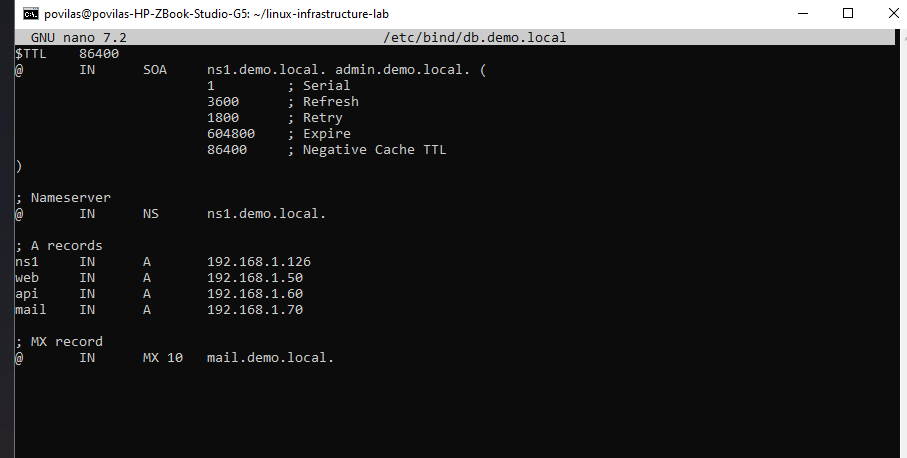  
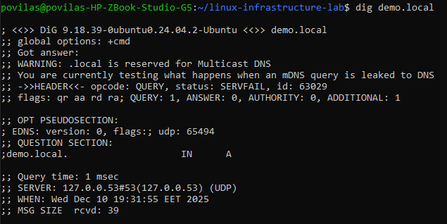

---

# ?? 4. El. paštas – Exim4

### ?? Kas padaryta:
- Sukonfiguruota vietine pašto sistema
- Pristatymas i `/var/mail/povilas`
- Testavimas komanda:
```
echo "Testas" | mail -s "Tema" povilas
```

### ?? Screenshot
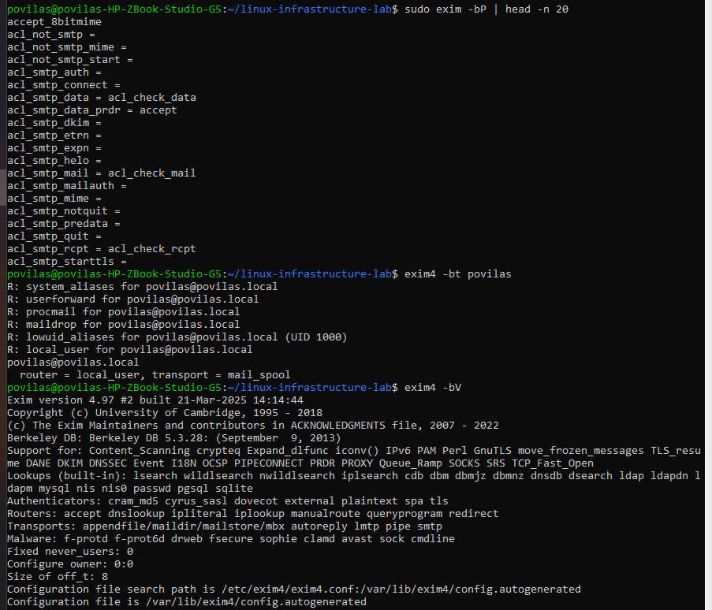  


---

# ?? 5. Firewall – UFW

### ?? Atidaryti portai:
```
22 (SSH)
80, 443 (Web)
3000 (Grafana)
9091 (Prometheus)
9100 (Node Exporter)
51820 (WireGuard VPN)
```

### ?? Screenshot
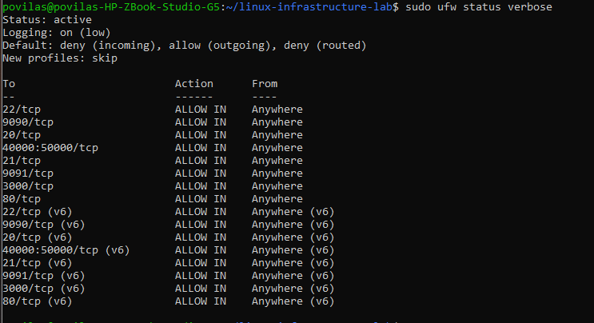

---

# ??? 6. VPN – WireGuard

### ?? Kas padaryta:
- Sugeneruoti raktai:
```
wg genkey | sudo tee server_private.key
sudo cat server_private.key | wg pubkey | sudo tee server_public.key
```

- Sukurtas `/etc/wireguard/wg0.conf`

### Minimalus serverio konfigas:
```
[Interface]
Address = 10.0.0.1/24
ListenPort = 51820
PrivateKey = <server_private_key>
```

### Paleidimas:
```
sudo systemctl enable wg-quick@wg0
sudo systemctl start wg-quick@wg0
```

### ?? Screenshot
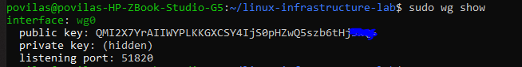  
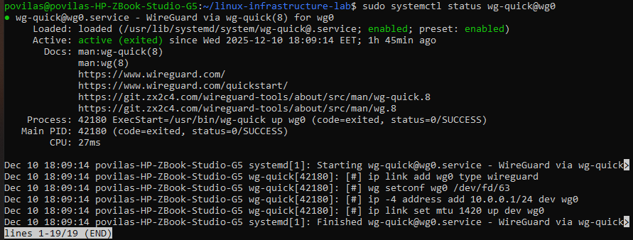

---

# ?? 7. Healthcheck API – PHP

### ?? Kas padaryta:
- Apache virtual host
- `/health/health.php` scriptas tikrina:
  - PHP veikima
  - MariaDB ryši
  - Serverio laika
  - Hostname

### Testavimas:
```
curl http://localhost/health/health.php
./check.sh
```

### ?? Screenshot
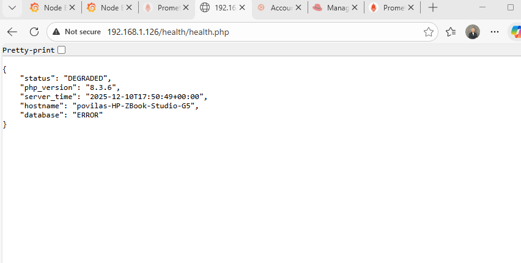

---

# ??? 8. MariaDB

- MariaDB instaliacija  
- Sukurtas DB naudotojas  
- API tikrina MySQL prisijungima  

### Komanda testuoti:
```
mysql -u root -p -e "SHOW DATABASES;"
```

---

# ?? 9. Saugumo priemones

- UFW firewall  
- WireGuard VPN  
- Restic šifruotos kopijos  
- Apriboti servisu leidimai  
- Konfiguruoti systemd servisai  
- Vengta root teisiu ten, kur nereikia  

---

# ?? 10. Darbo aprašymo atitikimas

Šis projektas irodo:

? Gebejima administruoti Linux sistemas  
? Gebejima valdyti Exim4, DNS, web serverius  
? VPN konfiguravima ir priežiura  
? Monitoringa ir našumo analize  
? Saugumo praktiku taikyma  
? Atsarginiu kopiju strategijos igyvendinima  
? Incidentu diagnostika  
? Dokumentacija ir procesu valdyma  

---

# ????? Autorius
**Povilas**  
Linux sistemu administratorius & PHP programuotojas  

Šis projektas yra mano profesinio portfolio dalis.

---

# ?? Licencija
Projekta leidžiama naudoti mokymosi ir demonstraciniais tikslais.
